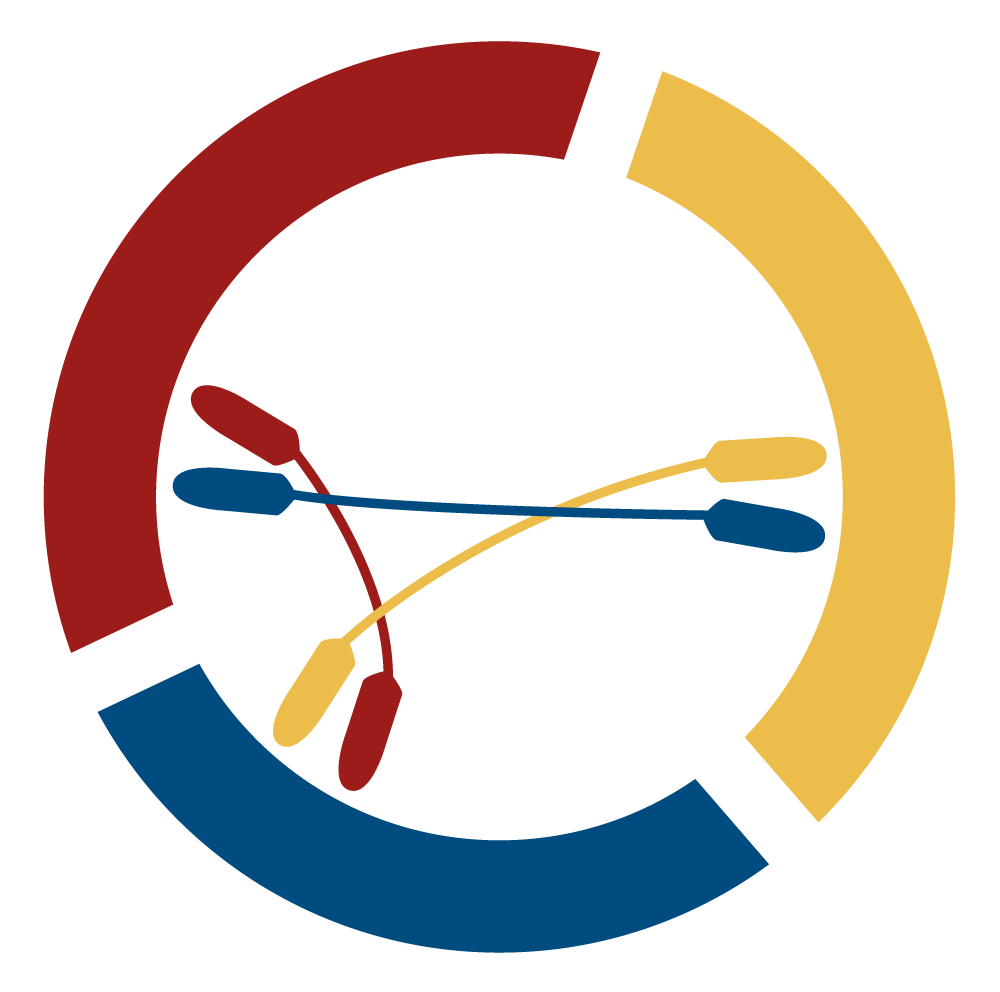

# PDataViewer



  [](https://opensource.org/licenses/Apache-2.0) [](https://zenodo.org/doi/10.5281/zenodo.13629127) [](https://www.bestpractices.dev/projects/9409) [](https://fair-software.eu)

PDataViewer is a web application that lets you explore the PD data landscape and identify cohort datasets that suit your research needs.

- [PDataViewer](#pdataviewer)
  - [Introduction](#introduction)
  - [Requirements](#requirements)
  - [Installation](#installation)
    - [Clone the Repository](#clone-the-repository)
    - [Install the Backend Requirements](#install-the-backend-requirements)
    - [Install the Frontend Requirements](#install-the-frontend-requirements)
  - [Usage](#usage)
    - [Starting the Backend Locally](#starting-the-backend-locally)
    - [Run the Backend via Docker](#run-the-backend-via-docker)
    - [Starting the Frontend Locally](#starting-the-frontend-locally)
    - [Run the Frontend via Docker](#run-the-frontend-via-docker)
    - [Run both the Frontend and Backend via Docker](#run-both-the-frontend-and-backend-via-docker)

## Introduction

Data collected in cohort studies lay the groundwork for a plethora of Parkinson’s disease (PD) research endeavors. PDataViewer lets you explore this PD data landscape and identify cohort datasets that suit your research needs. We accessed and curated major PD cohort datasets in a purely data-driven manner with the aim of:

1) characterizing their underlying data
2) assessing the quantity and availability of data
3) evaluating the interoperability across these distinct cohort datasets.

## Requirements

- Python >= 3.10
- [Angular = 17.1.0](https://angular.io/guide/setup-local)
- [Node.js (LTS) >= 18.13](https://nodejs.org/en/download/package-manager)
- TypeScript >= 5.2.0 < 5.4.0

## Installation

### Clone the Repository

```bash
git clone https://github.com/SCAI-BIO/PDataViewer
cd PDataViewer
```

### Install the Backend Requirements

```bash
cd backend
pip install -r requirements.txt
```

### Install the Frontend Requirements

```bash
curl -o- https://raw.githubusercontent.com/nvm-sh/nvm/v0.39.7/install.sh | bash
nvm install 20
npm install -g @angular/cli
```

## Usage

### Starting the Backend Locally

You can access the backend functionalities by accessing the provided REST API.

Run the Backend API on port 5000:

```bash
cd backend
uvicorn api.routes:app --reload --port 5000
```

### Run the Backend via Docker

The API can also be run via docker.

You can either build the docker container locally or download the latest build from the PDataViewer GitHub package registry.

To build the Docker container locally:

```bash
docker build -t ghcr.io/scai-bio/pdataviewer/backend:latest .
```

To download the latest build:

```bash
docker pull ghcr.io/scai-bio/pdataviewer/backend:latest
```

After building or downloading, you will be able to start the container and access the PDataViewer API by default on [localhost:8000](http://localhost:8000):

```bash
docker run -p 8000:80 ghcr.io/pdataviewer/scai-bio/backend:latest
```

### Starting the Frontend Locally

You can deploy a local version of the web application via Angular

You can access the web application on [localhost:4200](http://localhost:4200):

```bash
cd frontend
npm install
ng serve
```

### Run the Frontend via Docker

You can deploy a local version of the web application via docker.
You can either build the docker container locally or download the latest build from the PDataViewer GitHub package registry.

To build the Docker container locally:

```bash
docker build -t ghcr.io/scai-bio/pdataviewer/frontend:latest .
```

To download the latest build:

```bash
docker pull ghcr.io/scai-bio/pdataviewer/frontend:latest
```

After building or downloading, you will be able to start the container and access the PDataViewer web application by default on [localhost:8080](http://localhost:8080):

```bash
docker run -p 8080:80 ghcr.io/scai-bio/pdataviewer/frontend:latest
```

### Run both the Frontend and Backend via Docker

You can deploy a local version of the API and the web application together.

1. **Ensure Docker Compose is Installed**:
   Make sure you have Docker Compose installed on your machine. You can verify this by running:

   ```bash
   docker-compose --version
   ```

2. Navigate to the Root (PDataViewer) Folder
3. Build and Run the Containers:
  
   ```bash
   docker-compose -f ./docker-compose.local.yml up --build
   ```

4. Verify that the Containers are Running:

   ```bash
   docker ps
   ```

  This command lists all running containers. You should be able to see your containers with the name `pdataviewer-frontend` and `pdataviewer-backend`.
  
  You can access the web application on [localhost:3000](http://localhost:3000) and the API on [localhost:5000](http://localhost:5000)
